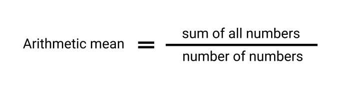

<h1 align="center">Arithmetic Mean</h1>

<h2 align="center">

[Live Demo](http://example.com)

</h2>

## Description
<h1 align="center"></h1>

This is a program that will allow you to quickly find the arithmetic mean.

Arithmetic mean is the sum of a collection of numbers divided by the count of numbers in the collection.

## How to use
<h1 align="center"></h1>

 - To start working with the program, you need to click on the "get started" button 

  - After that, a modal window will appear in which you will need to enter the total number of numbers

  - Then in the next modals you will need to write down each number  